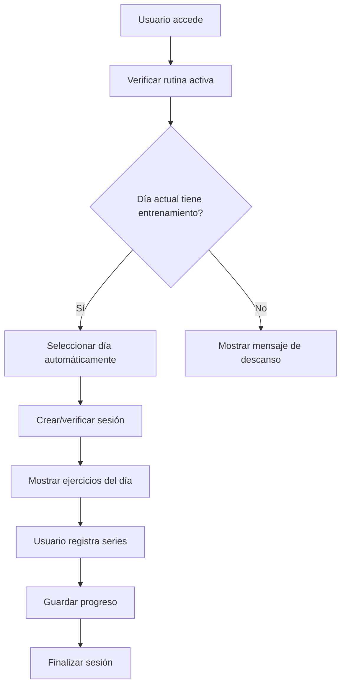

# 📊 Sistema de Progreso Completo - GetBig Fitness

## 🎯 Resumen Ejecutivo

El sistema de progreso de GetBig es una solución integral para el seguimiento y análisis del rendimiento físico de los usuarios. Proporciona herramientas avanzadas para registrar, visualizar y analizar el progreso corporal y de entrenamiento, con una interfaz intuitiva y funcionalidades científicamente respaldadas.

## 🏗️ Arquitectura del Sistema

### Estructura de Componentes

```
src/pages/progreso.jsx (Página Principal)
├── src/components/progreso/RoutineToday.jsx (Rutina del Día)
├── src/components/progreso/Evolution.jsx (Evolución y Análisis)
└── src/components/progreso/BodyFatCalculator.jsx (Calculadora Corporal)
```

### Componentes de Soporte

```
src/components/progreso/
├── ExerciseLogCard.jsx (Registro de Series)
├── LogrosProgreso.jsx (Sistema de Logros)
├── ResumenProgreso.jsx (Resumen Visual)
├── UnifiedBodyChart.jsx (Gráficos Unificados)
├── ExerciseProgressChart.jsx (Gráficos de Ejercicios)
├── BodyFatChart.jsx (Gráfico de Grasa Corporal)
├── BodyWeightChart.jsx (Gráfico de Peso)
└── MuscleMassChart.jsx (Gráfico de Masa Muscular)
```

## 📱 Página Principal de Progreso

### Ubicación: `src/pages/progreso.jsx`

**Funcionalidades:**
- **Navegación por Pestañas**: Sistema de pestañas dinámicas con 3 secciones principales
- **URL Sincronizada**: Las pestañas se sincronizan con parámetros de URL (`?tab=evolucion|rutina|composicion`)
- **Lazy Loading**: Componentes cargados bajo demanda para optimizar performance
- **Estados de Carga**: Indicadores de carga específicos para cada sección

**Estructura Visual:**
```jsx
<div className="progreso-container">
  {/* 3 Tarjetas de Navegación */}
  <TarjetaRegistroProgreso />
  <TarjetaRutinaHoy />
  <TarjetaComposicionCorporal />
  
  {/* Contenido Dinámico */}
  <Suspense fallback={<LoadingMessage />}>
    {activeTab === 'rutina' ? <RoutineToday /> : 
     activeTab === 'evolucion' ? <Evolution /> : 
     <BodyFatCalculator />}
  </Suspense>
</div>
```

## 🏋️ Sección: Rutina de Hoy

### Componente: `RoutineToday.jsx`

**Propósito**: Gestionar y ejecutar la rutina de entrenamiento del día actual.

#### Funcionalidades Principales

1. **Selección Automática de Día**
   - Detecta automáticamente el día de la semana actual
   - Verifica si hay entrenamiento programado para hoy
   - Muestra mensaje de descanso si no hay entrenamiento

2. **Gestión de Sesiones**
   - Crea automáticamente sesiones de entrenamiento
   - Evita duplicados verificando sesiones existentes
   - Maneja estados de sesión completada

3. **Interfaz de Ejercicios**
   - Tarjetas expandibles para cada ejercicio
   - Sistema de acordeón para organizar el contenido
   - Integración con `ExerciseLogCard` para registro de series

4. **Estados de la Aplicación**
   - **Loading**: Mientras se cargan los datos de rutina
   - **Error**: Manejo robusto de errores con opción de reintentar
   - **Sin Rutina**: Mensaje informativo si no hay rutina activa
   - **Día de Descanso**: Interfaz especial para días sin entrenamiento

#### Flujo de Trabajo



## 📈 Sección: Evolución y Análisis

### Componente: `Evolution.jsx`

**Propósito**: Sistema completo de análisis y seguimiento del progreso corporal y de ejercicios.

#### Funcionalidades Principales

1. **Guía Rápida Inteligente**
   - Sistema de navegación guiada con 4 secciones principales
   - Botones de acceso directo a funciones específicas
   - Scroll automático a secciones seleccionadas

2. **Registro de Progreso Corporal**
   - Formulario para peso, % grasa y % músculo
   - Validación de rangos científicos
   - Detección de cambios inusuales con confirmación
   - Auto-completado con último registro

3. **Visualización de Datos**
   - Gráficos interactivos con filtros de fecha
   - Múltiples métricas (peso, grasa, músculo)
   - Análisis de tendencias y promedios móviles

4. **Historial y Gestión**
   - Tablas de datos editables
   - Sistema de filtros avanzados
   - Exportación a CSV
   - Edición y eliminación de registros

#### Secciones de la Guía Rápida

| Sección | Función | Componente |
|---------|---------|------------|
| **Registrar Peso** | Formulario de progreso corporal | Formulario integrado |
| **Gráficos Corporales** | Visualización de evolución | `UnifiedBodyChart` |
| **Gráficos de Ejercicios** | Progreso por ejercicio | `ExerciseProgressChart` |
| **Ver Historial** | Gestión de registros | Tablas de datos |

#### Características Técnicas

- **Persistencia de Estado**: Filtros y configuraciones guardados en localStorage
- **URL Sincronizada**: Parámetros de filtro sincronizados con URL
- **Validación Inteligente**: Detección de cambios inusuales (±5% en 48h)
- **Optimización de Performance**: Debounce en filtros, memoización de cálculos

## 🧮 Sección: Calculadora de Composición Corporal

### Componente: `BodyFatCalculator.jsx`

**Propósito**: Calculadora científica de grasa corporal usando el método US Navy.

#### Funcionalidades Principales

1. **Método Científico**
   - Fórmulas oficiales de la Marina de EE.UU.
   - Diferentes cálculos para hombres y mujeres
   - Validación de rangos de medición

2. **Auto-completado Inteligente**
   - Pre-llenado desde perfil del usuario
   - Sincronización automática con cambios de perfil
   - Adaptación de interfaz según género

3. **Resultados Detallados**
   - Porcentaje de grasa corporal
   - Masa grasa en kilogramos
   - Masa muscular en kilogramos
   - Categorización automática

#### Fórmulas Implementadas

**Para Hombres:**
```
%GC = 495 / (1.0324 - 0.19077 × log10(cintura - cuello) + 0.15456 × log10(altura)) - 450
```

**Para Mujeres:**
```
%GC = 495 / (1.29579 - 0.35004 × log10(cintura + cadera - cuello) + 0.22100 × log10(altura)) - 450
```

#### Categorías de Grasa Corporal

**Hombres:**
- Grasa Esencial: 2-6%
- Atlético: 6-14%
- Fitness: 14-18%
- Aceptable: 18-25%
- Obesidad: >25%

**Mujeres:**
- Grasa Esencial: 10-12%
- Atlético: 12-21%
- Fitness: 21-25%
- Aceptable: 25-32%
- Obesidad: >32%

## 🎮 Componentes de Soporte

### ExerciseLogCard.jsx
**Función**: Registro de series de ejercicios
- Formulario dinámico de series (1-8 series)
- Validación de campos obligatorios
- Integración con base de datos
- Estados de carga y error

### LogrosProgreso.jsx
**Función**: Sistema de gamificación
- Cálculo de rachas de días
- Conteo de sesiones completadas
- Récords personales
- Mensajes motivacionales dinámicos

### ResumenProgreso.jsx
**Función**: Resumen visual de métricas
- Tarjetas animadas con datos clave
- Indicadores de tendencia (↑↓)
- Comparativas semanales y mensuales
- Accesibilidad completa

## 🎨 Sistema de Estilos

### Archivos CSS Principales

1. **Evolution.css**: Estilos para la sección de evolución
   - Guía rápida con botones interactivos
   - Formularios de registro
   - Tablas de historial
   - Gráficos y visualizaciones

2. **ExerciseLog.css**: Estilos para registro de ejercicios
   - Tarjetas de ejercicios expandibles
   - Formularios de series
   - Estados de carga
   - Animaciones de entrada

3. **BodyFatCalculator.css**: Estilos para calculadora
   - Formularios responsivos
   - Botones de género elegantes
   - Sección de resultados
   - Tema claro/oscuro

### Características de Diseño

- **Responsive Design**: Adaptación completa a móviles
- **Tema Dual**: Soporte para tema claro y oscuro
- **Animaciones**: Transiciones suaves y efectos visuales
- **Accesibilidad**: Cumplimiento de estándares WCAG
- **Variables CSS**: Sistema de variables para consistencia

## 🔧 Lógica de Negocio

### Gestión de Estado

1. **Contexto de Autenticación**
   - Acceso a datos del usuario
   - Sincronización con perfil
   - Manejo de sesiones

2. **Stores de Zustand**
   - `routineStore`: Gestión de rutinas
   - `uiStore`: Estados de interfaz
   - `userStore`: Datos del usuario

3. **Persistencia Local**
   - Filtros y configuraciones
   - Estados de formularios
   - Preferencias de usuario

### Integración con Base de Datos

**Tablas Principales:**
- `user_progress`: Registros de progreso corporal
- `exercise_logs`: Logs de ejercicios
- `workout_sessions`: Sesiones de entrenamiento
- `user_profiles`: Perfiles de usuario

**Operaciones CRUD:**
- Crear registros de progreso
- Actualizar y eliminar registros
- Consultas con filtros y ordenamiento
- Exportación de datos

## 📊 Métricas y Análisis

### Métricas de Progreso Corporal
- **Peso**: Seguimiento de cambios de peso
- **% Grasa**: Composición corporal
- **% Músculo**: Masa muscular
- **Tendencias**: Análisis de evolución temporal

### Métricas de Ejercicios
- **Peso**: Progresión de cargas
- **Repeticiones**: Volumen de entrenamiento
- **RPE**: Percepción de esfuerzo
- **Récords**: Mejores marcas personales

### Análisis Temporal
- **Comparativas**: Semanal vs mensual
- **Tendencias**: Promedios móviles
- **Alertas**: Cambios inusuales
- **Proyecciones**: Estimaciones de progreso

## 🚀 Optimizaciones de Performance

### Lazy Loading
- Componentes cargados bajo demanda
- Suspense boundaries para loading states
- Code splitting automático

### Memoización
- `useMemo` para cálculos costosos
- `useCallback` para funciones estables
- Memoización de componentes React

### Debounce
- Filtros con retraso para evitar consultas excesivas
- Input handlers optimizados
- Sincronización eficiente con URL

## 🔒 Seguridad y Validación

### Validación de Datos
- Rangos científicos para mediciones
- Validación de tipos de datos
- Sanitización de inputs
- Prevención de inyección SQL

### Manejo de Errores
- Try-catch en operaciones async
- Fallbacks para datos faltantes
- Mensajes de error informativos
- Recuperación automática

### Autenticación
- Verificación de sesiones
- Protección de rutas
- Validación de permisos
- Logout automático

## 📱 Experiencia de Usuario

### Navegación Intuitiva
- Guía rápida para nuevos usuarios
- Accesos directos a funciones
- Breadcrumbs y navegación contextual
- Estados de carga informativos

### Feedback Visual
- Animaciones de transición
- Indicadores de progreso
- Estados de éxito/error
- Confirmaciones de acciones

### Accesibilidad
- Navegación por teclado
- Lectores de pantalla
- Contraste adecuado
- Textos descriptivos

## 🔮 Funcionalidades Futuras

### Análisis Avanzado
- Machine learning para predicciones
- Análisis de correlaciones
- Recomendaciones personalizadas
- Comparativas con usuarios similares

### Integración Social
- Compartir logros
- Competencias entre usuarios
- Foros de discusión
- Mentoring entre usuarios

### Dispositivos IoT
- Integración con balanzas inteligentes
- Sincronización con wearables
- Medición automática de composición
- Alertas de salud

## 📈 Métricas de Éxito

### Engagement
- Frecuencia de uso del sistema
- Tiempo promedio en sesión
- Retención de usuarios
- Completitud de registros

### Calidad de Datos
- Precisión de mediciones
- Consistencia en registros
- Tiempo de respuesta
- Tasa de errores

### Satisfacción del Usuario
- Encuestas de satisfacción
- Feedback de funcionalidades
- Tiempo de aprendizaje
- Facilidad de uso

---

**Desarrollado por**: Asistente AI  
**Fecha**: Enero 2025  
**Versión**: 2.0.0  
**Estado**: ✅ Sistema completo y funcional
